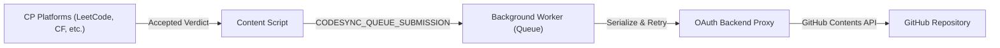

# CommitFlow v1.0

> **Effortless competitive programming synchronization to GitHub.**

CommitFlow is a Chrome Manifest V3 extension that automatically synchronizes your **Accepted** competitive programming solutions directly to your personal GitHub repository. It organizes your solutions with structured directory layouts, tracks your recent sync activity, and preserves every unique submission without overwriting previous attempts.

---

## ✨ Features

- **Automatic Live Capture**: Detects when your submission verdict turns **Accepted** and synchronizes code and metadata instantly in the background.
- **5 Major Competitive Programming Platforms**: Out-of-the-box support for **LeetCode**, **Codeforces**, **CodeChef**, **CSES**, and **AtCoder**.
- **Structured Hierarchy**: Intelligently groups solutions by topic, difficulty, rating, or contest slug.
- **Multi-Solution Preservation**: Each file path embeds the unique submission ID, ensuring multiple accepted approaches or optimizations for the same problem are preserved.
- **Durable Queue & Auto-Retry**: Built on `chrome.storage.local` with concurrency serialization, duplicate suppression, and exponential backoff retry for transient network or GitHub API errors (up to 5 attempts).
- **Recent Activity Feed**: Popup includes an activity log tracking your last 20 synced submissions with language tags, timestamps, and direct problem links.
- **Zero-Secret Security Model**: The extension stores no GitHub client secrets or personal access tokens (PATs). All GitHub interactions go through an authenticated OAuth backend using opaque, revokable session tokens.
- **LeetCode Historical Import**: Import previous accepted submissions directly from an authenticated LeetCode tab with built-in rate-limiting and pagination.
- **Modern, Accessible UI**: Compact popup interface with real-time status banners, repository management, platform indicators, and custom issue templates.

---

## 🌐 Supported Platforms & Organization

Solutions are committed using predictable folder paths and file extensions based on platform metadata:

| Platform | Directory Structure | Category Source |
| :--- | :--- | :--- |
| **LeetCode** | `LeetCode/<topic-or-difficulty>/<problemId>-<title>-<submissionId>.<ext>` | Alphabetically first topic tag from GraphQL; fallback to difficulty; fallback to `Uncategorized` |
| **Codeforces** | `Codeforces/<rating>/<problemId>-<title>-<submissionId>.<ext>` | Official problem rating from Codeforces problemset; fallback to `Unrated` |
| **CodeChef** | `CodeChef/<contest>/<problemId>-<title>-<submissionId>.<ext>` | Contest code or `Practice` |
| **CSES** | `CSES/<topic>/<problemId>-<title>-<submissionId>.<ext>` | Problem category from CSES problemset (e.g. `Dynamic Programming`, `Graph Algorithms`); fallback to `Uncategorized` |
| **AtCoder** | `AtCoder/<contest>/<problemId>-<title>-<submissionId>.<ext>` | Contest slug (e.g. `abc320`, `arc160`) or `Practice` |

### Language & Extension Detection

File extensions are automatically resolved based on the submission language:
- **C++**: `.cpp` (`C++17`, `C++20`, `GNU C++`, etc.)
- **Python**: `.py` (`Python 3`, `PyPy 3`, etc.)
- **Java**: `.java` (`Java 8`, `Java 17`, `Java 21`, etc.)
- **C**: `.c` (`C`, `GNU C`)
- **JavaScript / TypeScript**: `.js` / `.ts`
- **Rust**: `.rs`
- **Go**: `.go`
- **Kotlin**: `.kt`
- *Fallback*: `.txt`

---

## 🚀 Installation from Source

### Prerequisites

- [Node.js](https://nodejs.org/) (v20 or later recommended)
- `npm` (v10 or later)
- Google Chrome (or any Chromium-based browser supporting Manifest V3)

### 1. Clone & Install Dependencies

```bash
git clone https://github.com/SPDOCTORS/CodeSync.git
cd CodeSync
npm install
```

### 2. Build the Extension

```bash
npm run build
```

This compiles TypeScript (`tsc --noEmit`) and packages the production assets via Vite into the `dist/` directory.

### 3. Load into Chrome

1. Open Google Chrome and navigate to `chrome://extensions/`.
2. Toggle **Developer mode** on in the top-right corner.
3. Click **Load unpacked** in the top-left corner.
4. Select the `dist/` folder inside the project root.
5. The **CommitFlow** icon will now appear in your browser extensions toolbar.

---

## 🔑 GitHub Setup & Configuration

CommitFlow connects to GitHub via OAuth to push code directly to your repositories.

### Quick Start (Default Hosted Backend)

By default, CommitFlow is preconfigured to use the secure production backend: `https://code-sync-rho-brown.vercel.app`.

1. Click the CommitFlow extension icon in your Chrome toolbar.
2. In the popup (or via **Settings** in the context menu / options page), click **Connect GitHub** / **Sign in with GitHub**.
3. Authorize the application on GitHub.
4. Once connected, choose your target repository:
   - Click **Create repo** to automatically initialize a private `Competitive-Programming` repository with a README.
   - Click **Select existing** to choose from your personal repositories.
   - Or enter any repository in `owner/repo` format and click **Use**.

---

### Self-Hosting the OAuth Backend (Optional)

If you prefer to host your own backend:

1. **Create a GitHub OAuth App**:
   - Go to GitHub **Settings > Developer settings > OAuth Apps > New OAuth App**.
   - Set **Authorization callback URL** to:
     - `https://YOUR_DOMAIN/v1/oauth/github/callback` (production)
     - `http://localhost:8787/v1/oauth/github/callback` (local development)
2. **Environment Variables**:
   - `PUBLIC_BASE_URL`: Base URL of your backend (e.g. `https://commitflow.example.com` or `http://localhost:8787`).
   - `GITHUB_CLIENT_ID`: Your GitHub OAuth App Client ID.
   - `GITHUB_CLIENT_SECRET`: Your GitHub OAuth App Client Secret.
   - `REDIS_URL` *(Optional)*: Redis connection string (e.g. Upstash Redis) for persistent session caching. Defaults to memory storage when omitted.
   - `PORT` *(Optional)*: Server port (defaults to `8787`).
3. **Run Locally**:
   ```bash
   # Windows PowerShell example
   $env:PUBLIC_BASE_URL = 'http://localhost:8787'
   $env:GITHUB_CLIENT_ID = 'your-client-id'
   $env:GITHUB_CLIENT_SECRET = 'your-client-secret'
   npm run server
   ```
4. **Verify Health**:
   ```bash
   npm run server:check
   ```
5. In the extension **Settings**, enter your backend URL under **Authorization server** and save.

---

## 🔄 Automatic Sync & Queue Engine

### How It Works



1. **Detection**: Platform content scripts monitor live judging via mutation observers, status polls, or same-origin detail APIs.
2. **Filtering**: Only submissions with an **Accepted** verdict and valid source code are captured. Rejected, Pending, and Wrong Answer submissions are safely skipped.
3. **Deduplication**: Each submission is registered by its unique key (`<platform>:<submissionId>`). Re-submitting the same submission ID will not create duplicate commits.
4. **Queue Processing**: Submissions are committed sequentially to prevent Git tree SHA race conditions. If an identical file exists, the existing Git blob SHA is retrieved before updating.
5. **Exponential Backoff**: If GitHub API limits or network drops occur, items retry with exponential backoff up to 5 attempts. Items that fail permanently remain inspectable in the popup with a **Retry failed submissions** option.

---

## 📊 Recent Activity Feed

CommitFlow maintains a local history of your latest synchronization activity:

- Click **View activity →** in the popup to review your recent submissions.
- Keeps track of up to **20 most recent** completed solutions.
- Displays the problem title, platform badge, language, submission timestamp, and sync timestamp.
- Direct external links to open the original problem statement on the platform.

---

## 🔒 Privacy & Security Model

CommitFlow is designed with privacy-first principles:

- **No Secrets in Browser**: Neither your GitHub Client Secret nor personal access tokens are stored in the extension.
- **Opaque Session Tokens**: The browser stores only a high-entropy, random opaque session token in local storage that is verifiable solely by the backend.
- **Scoped Permissions**: The extension requests only permissions necessary for operation (`storage`, `identity`, `alarms`, `tabs`, `scripting`, and platform hosts).
- **Zero Telemetry or Analytics**: CommitFlow does not collect, track, or sell your competitive programming code, submissions, browsing habits, or personal information.
- **Direct to Your GitHub**: Code flows directly from your browser session to your designated GitHub repository via authenticated GitHub REST API calls.

---

## 🛠️ Troubleshooting

| Issue | Cause | Solution |
| :--- | :--- | :--- |
| **Submissions not syncing** | Problem was open before extension was installed or updated. | Reload the platform tab (e.g. `leetcode.com`) and ensure your submission verdict reaches **Accepted**. |
| **"Sign in again" error** | Backend session expired or GitHub OAuth access was revoked. | Open the popup, click **Disconnect** or **Settings**, and re-authenticate via **Sign in with GitHub**. |
| **Repository 404 / 403 error** | Configured repository is missing or account lacks write permissions. | Open Settings, verify the target `owner/repo`, and ensure your GitHub account has write access to the repository. |
| **LeetCode import stopped** | Tab closed or network rate-limit reached. | Keep the authenticated LeetCode tab open in your browser while the historical import is running. CommitFlow enforces a minimum 750ms delay between pages. |
| **Submissions stuck in "retrying"** | Temporary GitHub API disruption or network drop. | Verify internet connectivity and click **Retry queue** in the popup to re-trigger synchronization. |

---

## 🤝 Contributing & Development

Contributions, bug reports, and suggestions are welcome!

### Testing & Verification

Before submitting code changes, run the complete verification suite:

```bash
# Run all automated tests (231 tests)
npm test

# Run TypeScript type check and production build
npm run build
```

### Issue Templates

When reporting issues or suggesting enhancements, please use the provided GitHub templates:
- [Report a Bug](https://github.com/SPDOCTORS/CodeSync/issues/new?template=bug_report.md&labels=bug&title=%5BBug%5D%3A+)
- [Suggest a Feature](https://github.com/SPDOCTORS/CodeSync/issues/new?template=feature_request.md&labels=enhancement&title=%5BFeature%5D%3A+)

---

## 📄 License

This project is licensed under the MIT License.
Built with care by **[Senthil Kumar](https://github.com/SPDOCTORS)** ([LinkedIn](https://www.linkedin.com/in/senthil-kumar-76804730b/)).
